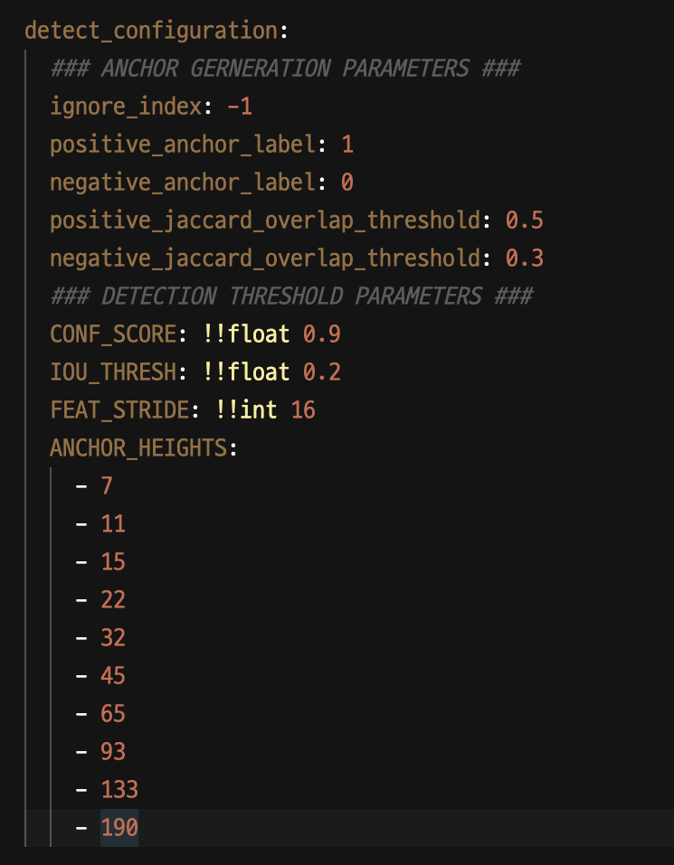

### (1) Directory Explanation of the project `ocr_exp_v1`

- The training process for the `text detection`, `text recognition` all uses the `base_trainer.py` in the `tools` folder, and the training entry code is the `base_runner.py`
``` py
ocr_exp_v1
|__ config
|__ flask_serve [Flask Demo App to show the Detection - Recognition Process]
|__ key_info_extraction [TODO]
|__ text_detection [CTPN Model + Data Utils + Loss Function]
|__ text_recognition [Hangul Net Model + Baseline Model]
|__ tools
    |- base_trainer.py
|- base_runner.py
```
- - -

### (2) Settings

#### 1. Clone the repository

``` sh 
git clone https://github.com/369-Speaking-Fridgey/ocr_exp_v1.git
```
#### 2. Installation
- First, you must create a virtual enviornment with th 3.6 version of python
- Activate your enviornment 
    - in the example below, you will be making an enviornment with the name `venv`
- Move to the cloned repository
- Install the required libraries with the `requirenemts.txt` file
    ``` sh
    conda create -n venv python=3.6
    conda activate venv
    cd ocr_exp_v1
    pip install requirements.txt
    ```
- - -

### (3) To run the Flask Demo App
**--> This can be done after the `SETTING` is finished (=previous step)**  

#### 0. Move to the folder `flask_serve`
``` sh
cd ocr_exp_v1/flask_serve
```

#### 1. Run the Flask Server in `Local Host`
- Since the 5000 local host port is running for the MLFlow operation, 3000 Port should be used.
``` sh
flask run -h localhost -p 3000
```

#### 2. The main page of the demo app
<div>
 
</div>

#### 3. Select the image you want to test on and check the results
- The `text recognition` result is not yet entirely successful - the Model is still training and trained weights will be updated soon
<div>

</div>

- - -

### (4) Training (Currently available for the CTPN Model)
#### 1. Move to the `ocr_exp_v1` folder
``` sh
cd ocr_exp_v1
```

#### 2. Check the `ctpn_detect_config.yml` file in the `config` folder
- You are able to change the settings in the `train_configuration` part
- The custom data to train on is available in the `zip` format
- The data must be stored in another folder, and currently the dataset I used to train is not uploaded in the repository. 
    1. Download the Image Zip Data from https://drive.google.com/drive/u/0/folders/1MIqs8PlNmuD3w2JZ91Mwvc9JlOm-pBGR here.
    2. Download the Label Zip Data from https://drive.google.com/file/d/1y4jwixUEfG4FSez-vJHRnv3C2-CwR4NH/view?usp=share_link here.
    3. Now, place the downloaded image & label data in the `data` folder outside the `ocr_exp_v1` folder
        - So, your structure must look like
        ``` py
        root
        |__ data [MUST MAKE THIS FOLDER]
            |_ zip datas downloaded (image & label)
        |__ ocr_exp_v1
        ```
    4. After that, change the `img_path` and `label_path` in the configuration file
- Other important settings for training the `CTPN` model is customizable with the `detect_configuration` in the `ctpn_detect_config.yml` file.
    <div>
    
    </div>

#### 3. Train
``` sh
python3 base_runner.py
```

