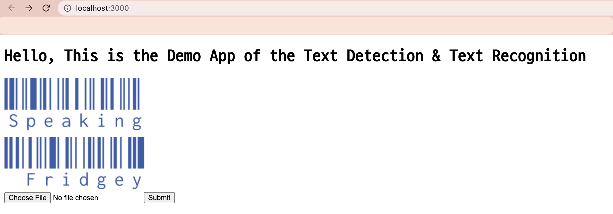
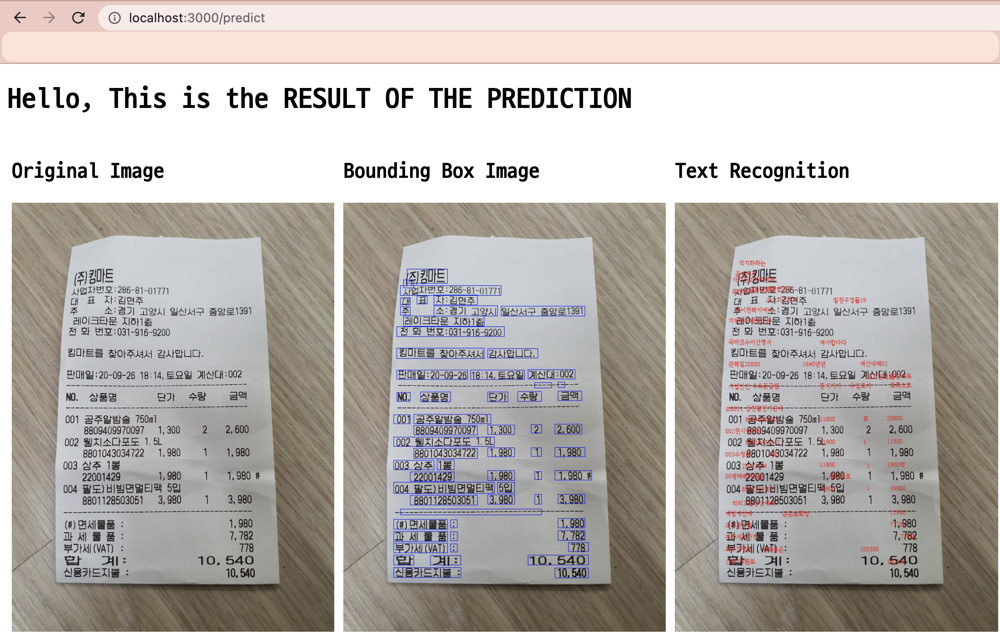

#### (1) Directory Explanation of the project `ocr_exp_v1`
- The training process for the `text detection`, `text recognition` all uses the `base_trainer.py` in the `tools` folder, and the training entry code is the `base_runner.py`
``` py
ocr_exp_v1
|__ config
|__ flask_serve [Flask Demo App to show the Detection - Recognition Process]
|__ key_info_extraction [TODO]
|__ text_detection [CTPN Model + Data Utils + Loss Function]
|__ text_recognition [Hangul Net Model + Baseline Model]
|__ tools
    |- base_trainer.py
|- base_runner.py
```

#### (2) To Run the Flask Demo App
1. Move to the folder `flask_serve`
``` sh
cd ocr_exp_v1/flask_serve
```
2. Run the Flask Server in `Local Host`
- Since the 5000 local host port is running for the MLFlow operation, 3000 Port should be used.
``` sh
flask run -h localhost -p 3000
```

3. The main page of the demo app
<div>
 
</div>

4. Select the image you want to test on and check the results
- The `text recognition` result is not yet entirely successful - the Model is still training and trained weights will be updated soon
<div>

</div>


#### (3) To `TRAIN` the `text detection` model with custom dataset & check on `MLFlow`
